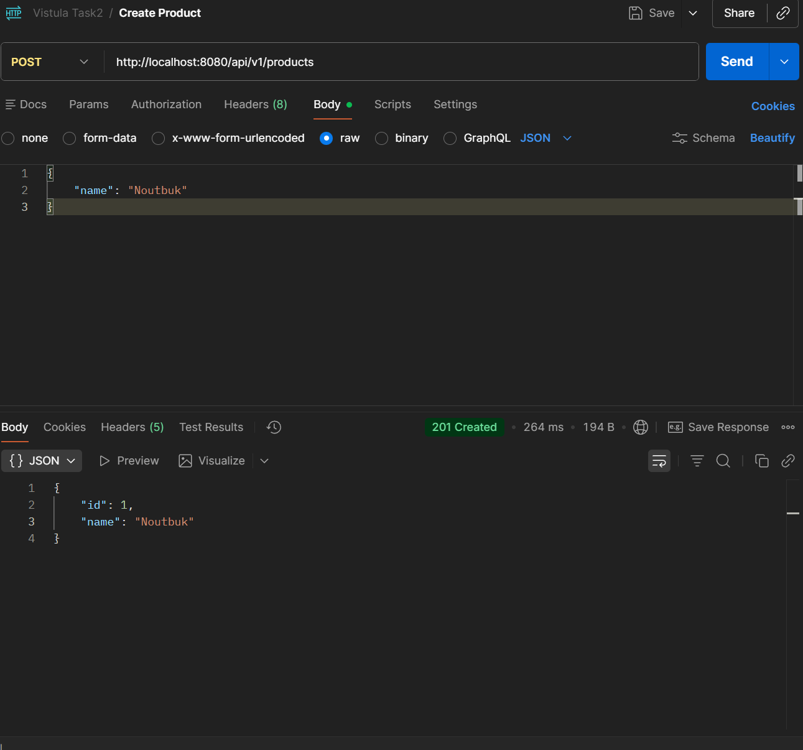

# Spring Boot REST API - Product Management System

## 📌 Project Overview
A fully functional REST API application built with Spring Boot for managing products. This project demonstrates complete CRUD operations with proper error handling, database integration, and API documentation.

## 🚀 Technologies Used
- **Java 17**
- **Spring Boot 3.x**
- **Spring Web** (REST Controllers)
- **Spring Data JPA** (Database operations)
- **H2 Database** (In-memory database)
- **SpringDoc OpenAPI** (Swagger UI)
- **Maven** (Build tool)
- **Postman** (API testing)

## 📋 Features Implemented
✅ **Full CRUD Operations** - Create, Read, Update, Delete  
✅ **RESTful API Design** - Proper HTTP methods and status codes  
✅ **Database Integration** - JPA with Hibernate  
✅ **Error Handling** - Custom exceptions with meaningful messages  
✅ **API Documentation** - Interactive Swagger UI  
✅ **Layered Architecture** - Controller-Service-Repository pattern  
✅ **DTO Pattern** - Separate request/response objects

## 📊 API Endpoints

### Base URL: `http://localhost:8080`

| Method | Endpoint | Description | Request Body |
|--------|----------|-------------|--------------|
| **POST** | `/api/v1/products` | Create new product | `{"name": "Product Name"}` |
| **GET** | `/api/v1/products` | Get all products | None |
| **GET** | `/api/v1/products/{id}` | Get product by ID | None |
| **PUT** | `/api/v1/products/{id}` | Update product | `{"name": "New Name", "id": 1}` |
| **DELETE** | `/api/v1/products/{id}` | Delete product | None |

## 🧪 API Testing Results

### 1. Create Product (POST)
**Request:**
```json
{
    "name": "Noutbuk"
}


